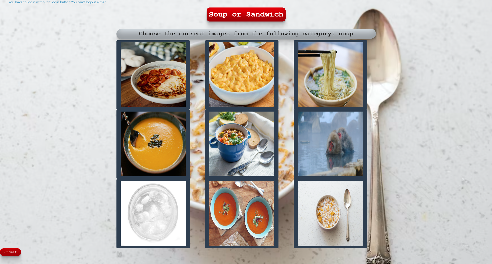

# Soup-or-Sandwich

## Description

 A game where the user must choose a picture according to the instructions. The pictures consist of soup and sandwiches, or maybe not. The user can login to save their progress or score.

## Table of Contents

- [Installation](#installation)
- [Usage](#usage)
- [Credits](#credits)
- [License](#license)

## Installation

You can reach this webpage through any web browser. No installation is required.
<a href="https://soup-or-sandwich.herokuapp.com/" target="_blank">Click here for the Soup or Sandwich website.</a>

## Usage

The user can log in through google and start playing the game. The user must choose pictures according to the given criteria and receive a score in the end.

## Credits

- Collaborators: 
<a href="https://github.com/Wdiste" target="_blank">William Distefano</a>, 
<a href="https://github.com/kendrameda" target="_blank">Kendra Gibson</a>, 
<a href="https://github.com/azimezn" target="_blank">Azime Nail</a>, 
<a href="https://github.com/marcnicolas0915" target="_blank">Marc Nicolas</a>
- Technologies used: 
<a href="https://expressjs.com/" target="_blank">express.js</a>, 
<a href="https://www.mysql.com/" target="_blank">MySQL</a>, 
<a href="https://www.passportjs.org/" target="_blank">passport.js</a>, 
<a href="https://sequelize.org/" target="_blank">Sequelize</a>, 
<a href="https://tholman.com/elevator.js/" target="_blank">elevator.js</a>

## License

N/A